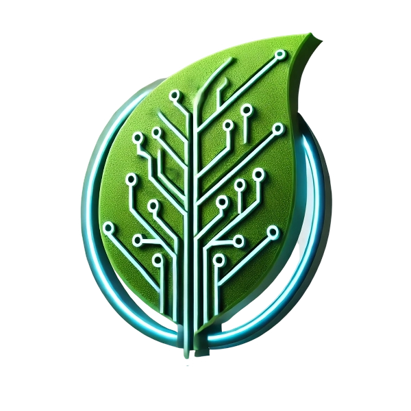

  

## Teammember introduction
1. **Liaw Hang Sheng:** Team Leader, Project Manager, Flutter developer, Business developer
2. **Neo Zheng weng:** Flutter developer, Business developer

# MoTech Malaysia 🌱  
**Empowering Farmers with AI, IoT, and Gamified Sustainability**  

---

## 📱 Overview  
**MoTech Malaysia** is a farmer-centric mobile application designed to revolutionize agriculture in Malaysia through **real-time data insights**, **AI-driven recommendations**, and **gamified learning**. Aligned with **UN SDG 2** (*Zero Hunger*), the app aims to double smallholder productivity by 2030 by addressing challenges like crop diseases, resource inefficiency, and financial barriers.  

**Target Users**: Smallholder farmers, fisherfolk, pastoralists, and agri-cooperatives in Malaysia.  

---

## 🌟 Key Features  

### 1. AI-Powered Crop Health Analysis 🔍 
- **Instant Diagnosis**: Upload crop photos to detect diseases (e.g., rice blast), pests, and nutrient deficiencies.  
- **Treatment Plans**: Tailored organic/chemical solutions with links to buy products.  
- **Growth Stage Tracking**: Monitor crops from planting to harvest.  

### 2. Smart IoT Integration 📡  
- **Real-Time Dashboards**: Soil moisture, pH, temperature, and weather data.  
- **Predictive Alerts**: Frost warnings, drought risks, and irrigation schedules.  

### 3. Farm Financial Hub 💰  
- **Income/Expense Tracker**: Visualize profits with interactive charts.  
- **Microloans & Insurance**: Pre-approved loans and automated claim filing.  
- **Market Price Trends**: Real-time data for palm oil, rice, and regional crops.  

### 4. Agricultural Marketplace 🛒  
- **Direct Buyer Connections**: List verified produce (e.g., MSPO-certified palm oil).  
- **Input Marketplace**: Buy/Rent equipment, seeds, and eco-friendly fertilizers.  

### 5. Knowledge & Community Hub 👩🌾  
- **Localized Tutorials**: Video guides in Bahasa Malaysia, Tamil, and indigenous languages.  
- **Farmer Forums**: Discuss pest control, sustainability, and success stories.  

### 6. Gamified Sustainability 🎮 
- **Quests & Badges**: Earn rewards for reducing water usage or adopting organic practices.  
- **Leaderboards**: Compete regionally (e.g., "Top 10 Paddy Farmers in Kedah").  
- **AR Pest Hunter**: Zap virtual pests to learn real-world solutions.  

---

## 🛠️ Technology Stack  
- **AI/ML**: TensorFlow, PyTorch (disease detection), YOLOv8 (pest identification).  
- **IoT**: Raspberry Pi/Arduino sensors, AWS IoT Core.  
- **Cloud**: Firebase (user data).  
- **Frontend**: Flutter  
- **APIs**: WeatherStack, Malaysia Agro Exchange (AGRO1).  

---

## 💡 Business Model  
- **Freemium**: Basic features free; RM20/month for premium analytics.  
- **Data Partnerships**: Sell anonymized crop/soil trends to agribusinesses.  
- **Marketplace Commission**: 5% fee on transactions.  
- **Sponsorships**: Partner with brands (e.g., Bayer, Sime Darby).  

---

## 🚀 Future Roadmap  
- **Blockchain Integration**: Transparent supply chains for premium produce.  
- **AR/VR Training**: Immersive modules for climate adaptation.  
- **Regional Expansion**: Adapt for Indonesia and Thailand.  

---

## 🌍 Impact on SDGs  
- **SDG 2.3**: Doubles productivity via precision farming tools.  
- **SDG 2.4**: Promotes soil health and climate resilience.  

---

## 📜 License  
MIT License. Developed for the [Hackathon Name].  

---

**Let’s grow sustainability, one farm at a time!** 🌾  

